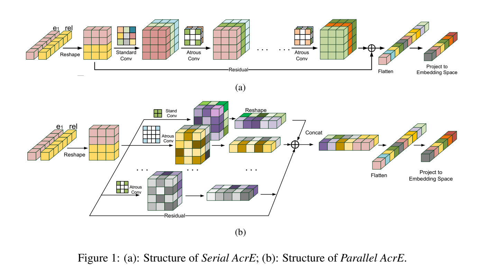

<h1 align="center">AcrE</h1>
<h4 align="center">Source codes for our COLING 2020 paper: Knowledge Graph Embedding with Atrous Convolution and Residual Learning.
</h4>
<h2 align="center">
  Overview of AcrE
  
</h2>
We denote our model as AcrE (the abbreviation of Atrous Convolution and Residual Embedding). We design two structures to integrate the standard convolution and atrous convolutions together.
One is a serial structure as shown in Figure 1 (a), and the other is a parallel structure as shown in Figure
1 (b). Please refer to the paper for details.

### Requirements
* Compatible with PyTorch 1.0 and Python 3.x.
* Dependencies can be installed using requirements.txt.

### Datasets
* We use FB15k-237,FB15k,DB100K,Kinship,WN18RR,WN18 datasets for evaluation, and they are included in the repo.

### Training and evaluate on datasets
* Install all the requirements from `requirements.txt.`
* Execute `sh preprocess.sh` for extracting the datasets and setting up the environment.
* The command for training arce and its prompt are below:
  - `data` indicates the dataset used for training the model.
  - `gpu` is the GPU used for training the model.
  - `name` is the provided name of the run which can be later used for restoring the model.
  - Execute `python acre.py --help` for listing all the available options.
	```
	#Serial fb15k237
	python -u acre.py --data FB15k-237 --batch 128 \
	--hid_drop 0.5 --feat_drop 0.2 --lr 0.001 --inp_drop 0.3  --gpu 0 --name fb15k_237_s --way s --train_strategy one_to_x

	#Serial fb15k
	python -u acre.py --data FB15k --batch 256 \
	--hid_drop 0.2 --feat_drop 0.2 --lr 0.001 --inp_drop 0.2  --gpu 0 --name fb15k_s --way s --train_strategy one_to_n

	#Serial kinship
	python -u acre.py --data kinship --batch 128 \
	--hid_drop 0.5 --feat_drop 0.5 --lr 0.001 --inp_drop 0.2  --gpu 0 --name kinship_s --way s --train_strategy one_to_n

	#Serial WN18RR
	python -u acre.py --data WN18RR --batch 256 \
	--hid_drop 0.5 --feat_drop 0.1 --lr 0.00125 --inp_drop 0.2  --gpu 0 --name wn18rr_s --way s --train_strategy one_to_n

	#Serial WN18
	python -u acre.py --data WN18 --batch 256 \
	--hid_drop 0.3 --feat_drop 0.3 --lr 0.0012 --inp_drop 0.2  --gpu 0 --name wn18_s --way s  --train_strategy one_to_n

	#Serial DB100K
	python -u acre.py --data DB100K --batch 256 \
	--hid_drop 0.3 --feat_drop 0.2 --lr 0.0012 --inp_drop 0.2  --gpu 0 --name db100k_s --way s --train_strategy one_to_x

	#Parallel fb15k237
	python -u acre.py --data FB15k-237 --batch 128 \
	--hid_drop 0.5 --feat_drop 0.2 --lr 0.001 --inp_drop 0.3  --gpu 0 --name --fb15k_237_p --way p --train_strategy one_to_x

	#Parallel fb15k
	python -u acre.py --data FB15k --batch 256 \
	--hid_drop 0.2 --feat_drop 0.2 --lr 0.001 --inp_drop 0.2  --gpu 0 --name --fb15k_p --way p  --train_strategy one_to_n

	#Parallel kinship
	python -u acre.py --data kinship --batch 128 \
	--hid_drop 0.5 --feat_drop 0.2 --lr 0.0001 --inp_drop 0.3  --gpu 0 --name --kinship_p --way p  --train_strategy one_to_n

	#Parallel WN18RR
	python -u acre.py --data WN18RR --batch 256 \
	--hid_drop 0.5 --feat_drop 0.1 --lr 0.00125 --inp_drop 0.3  --gpu 0 --name --wn18rr_p --way p --train_strategy one_to_x

	#Parallel WN18
	python -u acre.py --data WN18 --batch 256 \
	--hid_drop 0.3 --feat_drop 0.3 --lr 0.0012 --inp_drop 0.2 --gpu 0 --name --wn18_p --way p --train_strategy one_to_x

	#Parallel DB100K
	python -u acre.py --data DB100K --batch 256 \
	--hid_drop 0.3 --feat_drop 0.2 --lr 0.0012 --inp_drop 0.2  --gpu 0 --name --db100k_p --way p --train_strategy one_to_x
	```
### Citation

### Acknowledgement
Parts of our codes come from [InteractE](https://github.com/malllabiisc/InteractE). Thanks for their contributions.
